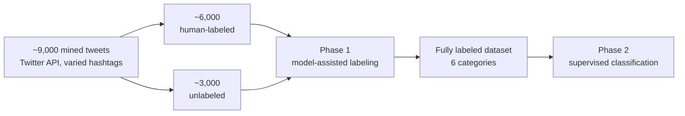

# Bilingual Tweet Classification — English & Roman Urdu

Semi-supervised classification of code-switched **English / Roman-Urdu tweets** into six content categories, using a two-phase pipeline: model-assisted labeling of unlabeled data, followed by supervised multiclass classification.

📄 **[Read the research paper](docs/Bilingual-Classification.pdf)** — *Labeling & Classification of Bilingual Tweets*. 

## 🧾 Attribution

B.Sc. Final Year Project, Department of Computer Science, University of Karachi — four-person team: **Danish Mahmood Ali**, Muhammad Ibad, Ali bin Ejaz, Reeba Nadeem, supervised by Dr. Muhammad Saeed and Ms. Maryam Feroze. The resulting research paper was co-authored with the supervisors and Dr. Ayaz H. Khan (KFUPM), whose earlier work with M. Zubair — [*Classification of multi-lingual tweets into multi-class model using Naïve Bayes and semi-supervised learning*, Multimedia Tools and Applications, 2020](https://doi.org/10.1007/s11042-020-09512-2) — this project extends with his permission.

## ❓ Why this is hard

Roman Urdu — Urdu written in Latin script — has **no standardized spelling** (the same word can appear a dozen ways), and real tweets freely code-switch between it and English mid-sentence. Labeled data is scarce and expensive: annotator judgments on tweet categories vary with background and politics. Standard supervised approaches assume clean, plentiful labels; this problem offers neither.

## 🔄 The two-phase approach



**Six categories:** Politics · Fun Talks · Technology · Current Affairs · Entertainment · Others

- **Preprocessing:** JSON → plain text, removal of URLs/emoticons, lowercasing, stop-word removal, stripping of @mentions and #hashtags (hashtags were deliberately *excluded* as features — they act as biased shortcuts that mislead classification, e.g. sarcastic tweets reusing a positive hashtag), encoding validation, removal of non-alphabetic characters. Retweets were kept after testing showed they improve performance.
- **Features:** Bag-of-Words over the most frequent tokens, one-hot encoded; dictionary size treated as a hyperparameter (3,000 / 3,500 / 4,000 words)
- **Phase 1 (labeling):** a model trained on the human-labeled tweets assigns categories to the unlabeled remainder
- **Phase 2 (classification):** supervised models trained on the full labeled set, evaluated on held-out data. Tuned via manual search over a defined hyperparameter space: `LinearSVC(C=12.0, max_iter=7000)`, `ComplementNB(norm=True)`, `MultinomialNB(alpha=0.001)`

## 📊 Results

### The key diagnostic finding

Initial phase-1 labeling with Multinomial NB and Linear SVM collapsed: **80–85% of unlabeled tweets were dumped into just two categories** ("current affairs" / "others"), and manual inspection showed these labels were usually wrong. Root cause: the human-labeled data itself was heavily imbalanced — nearly half belonged to those two classes, and the models amplified the skew. **Complement Naive Bayes**, designed for imbalanced data, produced a far healthier label distribution and was selected for phase 1.

### Phase 2 — classification accuracy by dictionary size

| Phase-2 model | 3,000 words | 3,500 words | 4,000 words |
|---|---|---|---|
| **Linear SVM** | 90.0% | 90.6% | **92.4%** |
| Multinomial NB | 83.5% | 80.8% | 83.2% |
| Complement NB | 73.5% | 76.2% | 76.5% |

*Best result per configuration across phase-1 labeling variants; full 3×3 cross-tables (phase-1 × phase-2 model, with recall/precision/F-measure) in the paper (Tables 2.10–2.12). The top configuration — Linear SVM in both phases, 4,000-word dictionary — reached **92.4% accuracy, 89.4% precision, 88.7% recall**.*

### Takeaways

1. **Recommended pipeline: Complement NB (phase 1) → Linear SVM (phase 2)** — the best trade-off between honest labeling and classification accuracy (~85%), improving on the prior study whose headline accuracy (87.5%) was inflated by the label imbalance it never corrected.
2. **Linear SVM dominates the supervised phase** — consistently ≥90%, peaking at 92.4% — though at the highest computational cost of the three models, especially when used in both phases.
3. **Bigger dictionaries help, then plateau** — accuracy rises up to 4,000 words; beyond that, gains vanish while compute cost grows.

## 🧪 Explored but not adopted

- **Spark NLP** (John Snow Labs) was evaluated as a candidate for scalable preprocessing and classification, but not included in the final system. The experimental notebook is preserved in [`notebooks/`](notebooks/) for reference.
- **A fuzzy similarity index** for dictionary generation — collapsing spelling variants (`hello`/`helo`, endemic in Roman Urdu) into single entries — was implemented but dropped: the pairwise comparison cost grew quadratically (up to ~30 minutes even on small dictionaries) while accuracy gains were negligible. A worked example of measuring a trade-off before shipping it.
- **KNN and Random Forest** were tested alongside the three final models but underperformed and were cut.

## 📦 Dataset

The tweet dataset was mined via the Twitter API across trending hashtags at multiple points in time. It is not distributed in this repository; contact the authors for research access.

## 📁 Repository structure

```
├── notebooks/
│   ├── Tweet_Classification.ipynb   # Main pipeline: preprocessing, both phases, evaluation
│   └── SparkNLP.ipynb               # Exploratory Spark NLP alternative (not in final system)
├── docs/
│   └── Bilingual-Classification.pdf      # Full paper: methodology, all result tables, discussion
├── requirements.txt
└── README.md
```

## 🚀 Setup

```bash
git clone https://github.com/danishmahmoodali/bilingual-tweet-classification.git
cd bilingual-tweet-classification
python -m venv .venv && source .venv/bin/activate
pip install -r requirements.txt
jupyter notebook notebooks/
```
