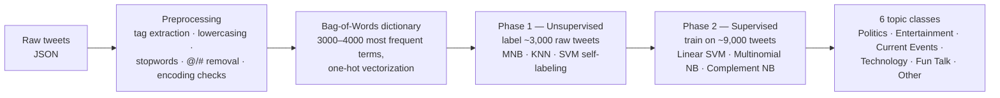

# Bilingual Tweet Classification (English + Roman Urdu)

Semi-supervised topic classification of **code-mixed English / Roman Urdu tweets** — a two-phase machine learning pipeline that labels unannotated tweets with an unsupervised model, then trains supervised classifiers on the expanded corpus. Best configuration: **Linear SVM at 90% accuracy**, improving on the predecessor project's 87.5% baseline.

📄 **[Read the full thesis](docs/Bilingual Classification.pdf)** — B.Sc. Computer Science Final Year Project, University of Karachi (2023).

## 🧾 Attribution

Team project by **Danish Mahmood Ali**, Muhammad Ibad, Ali bin Ejaz, and Reeba Nadeem, supervised by Dr. Muhammad Saeed and Ms. Maryam Feroze (Dept. of Computer Science, University of Karachi). The project extends earlier work by Dr. Ayaz on bilingual tweet labeling.

## ❓ Why this is hard

Roman Urdu — Urdu written in Latin script — has **no standardized spelling** ("zindagi" / "zindagee" / "zindgi" are the same word), and tweets freely code-switch between it and English mid-sentence. Off-the-shelf English NLP tooling fails on this text, so the pipeline builds its own dictionary-based feature representation from the corpus itself. Add severe class imbalance (nearly half the human-labeled tweets fall into just two of the six categories) and noisy user-generated text, and standard classifiers need deliberate countermeasures at every stage.

## 🔄 The two-phase approach



- **Corpus:** ~9,000 tweets — ~6,000 human-annotated + ~3,000 labeled by the Phase-1 model
- **Features:** bag-of-words over corpus-derived dictionaries (3,000 / 3,500 / 4,000 words compared), one-hot encoded
- **Imbalance countermeasures:** dataset expansion and Complement Naive Bayes (designed for skewed class distributions) evaluated against Multinomial NB and Linear SVM

## 📊 Results (Phase 2, by dictionary size)

| Model | Metric | 3,000 words | 3,500 words | 4,000 words |
|---|---|---|---|---|
| **Linear SVM** | **Accuracy** | **0.900** | 0.847 | 0.860 |
| | Recall (macro) | 0.824 | 0.774 | 0.819 |
| | Precision (macro) | 0.851 | 0.802 | 0.807 |
| Complement NB | Accuracy | 0.676 | 0.735 | 0.729 |

Linear SVM with the 3,000-word dictionary was the best configuration overall — surpassing the previous iteration of the project (87.5%, Multinomial NB) while the team simultaneously corrected for the dataset imbalance that had inflated the earlier figure. Full result tables for all models and phases are in the [thesis](docs/FYP_Research_Paper.pdf).

## ⚠️ Honest limitations

- Accuracy on an imbalanced multi-class problem overstates performance on minority classes — macro recall/precision (reported above) give the fairer picture.
- Phase-1 self-labeling propagates its own errors into the Phase-2 training data; the thesis documents that early unsupervised runs over-assigned the "Other" category and required rework.
- Bag-of-words with one-hot features ignores word order and spelling variation — a transformer-based approach (e.g., multilingual BERT) would be the natural next step today.

## 📁 Repository structure

```
├── notebooks/
│   └── tweet_classification.ipynb   # Preprocessing, dictionary generation, both phases
├── docs/
│   ├── FYP_Research_Paper.pdf       # Full thesis
│   └── FYP_Research_Paper.docx
├── requirements.txt
└── README.md
```

> **Note on data:** the tweet corpus is not redistributed in this repository, in line with X/Twitter's terms of service on dataset sharing. The notebook documents the expected input format (JSON tweets, label-annotated CSVs).

## 🛠️ Tech stack

`Python` · `scikit-learn` (LinearSVC, MultinomialNB, ComplementNB, KNeighborsClassifier) · `NLTK` · `pandas` · `NumPy`
